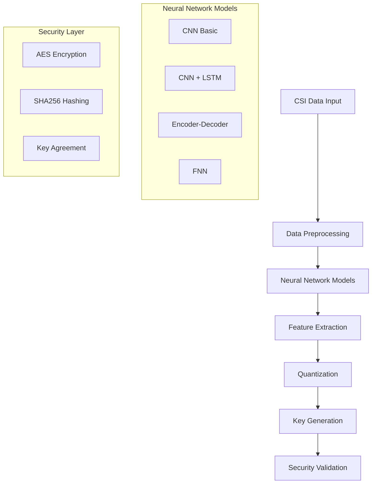

# PLKG Machine Learning - Physical Layer Key Generation System


## 專案簡介

PLKG (Physical Layer Key Generation) 是一個基於 Channel State Information (CSI) 的物理層金鑰生成系統，使用深度學習技術從無線通訊的 CSI 數據中生成安全金鑰。系統支援多種神經網路架構，包括 CNN、LSTM、自編碼器等，並整合了量化、加密等安全機制。

## 目錄

- [系統架構](#系統架構)
- [專案結構](#專案結構)
- [核心模組](#核心模組)
- [模型說明](#模型說明)
- [使用指南](#使用指南)
- [API 參考](#api-參考)
- [評估指標](#評估指標)
- [實驗結果](#實驗結果)
- [範例程式](#範例程式)
- [常見問題](#常見問題)

## 系統架構



## 專案結構

```
plkg_ml/
├── models/                          # 神經網路模型定義
│   ├── __init__.py
│   ├── cnn_basic.py                # 基礎 CNN 模型
│   ├── cnn_basic_quan.py           # 量化 CNN 模型
│   ├── cnn_with_LSTM.py            # CNN + LSTM 混合模型
│   ├── cnn_speed.py                # 包含速度資訊的 CNN
│   ├── cnn_speed_quan_with_LSTM.py # 量化 CNN + LSTM + 速度
│   ├── encoder_*.py                # 自編碼器模型
│   ├── fnn_*.py                    # 前饋神經網路
│   └── crnet.py, crsnet.py         # 其他網路架構
├── test_set/                       # 測試數據集
│   ├── normalized_training_set.npy
│   ├── normalized_testing_set.npy
│   └── test_set_*/                 # 不同實驗條件的數據集
├── result/                         # 實驗結果與分析
│   ├── res_final.ipynb
│   ├── res_quan.ipynb
│   └── *.ipynb                     # Jupyter 筆記本
├── model_reserved/                 # 預訓練模型
│   ├── cnn/
│   ├── cnn_basic/
│   ├── cnn_lstm/
│   └── */model_final.pth
├── LSTM_model/                     # LSTM 模型檔案
├── image/                          # 圖片資源與結果
├── dataset.py                      # 數據集處理類
├── training.py                     # 主訓練腳本
├── training_core.py                # 訓練核心函數
├── training_core_copy.py           # 訓練核心函數 (副本)
├── eval.py                         # 評估函數
├── testing.py                      # 測試腳本
├── relation.py                     # 模型與數據集關聯配置
├── greycode_quantization.py        # 灰碼量化
├── aes.py                          # AES 加密實現
├── aes_sample.py                   # AES 加密示例
├── sha256.py                       # SHA256 雜湊
└── README.md                       # 本文件
```

## 核心模組

### 1. 數據集模組 (dataset.py)

提供多種數據集類別來處理不同格式的 CSI 數據：

#### 基礎數據集類別
```python
class base_Dataset(Dataset):
    """基礎數據集類，處理 RSSI 數據"""
    def __init__(self, data: np.array)
```

#### 專用數據集類別
- **`csi_dataset`**: 純 CSI 數據處理
- **`csi_cnn_dataset`**: CNN 專用的 CSI 數據格式
- **`csi_cnn_lstm_dataset`**: CNN+LSTM 組合的數據格式
- **`csi_quan_dataset`**: 量化 CSI 數據
- **`csi_cnn_quan_dataset`**: 量化 CNN CSI 數據

### 2. 訓練系統 (training_core_copy.py)

#### 主要訓練函數
```python
def training(model, data_loader, val_loader, folder, 
             checkpoint=100, epoch=500, learning_rate=0.001, quantization=False):
    """
    主要訓練函數
    
    參數:
        model: 神經網路模型類
        data_loader: 訓練數據載入器
        val_loader: 驗證數據載入器 (可選)
        folder: 模型儲存資料夾
        checkpoint: 檢查點儲存間隔
        epoch: 訓練世代數
        learning_rate: 學習率
        quantization: 是否使用量化損失
    """
```

#### 測試函數
```python
def testing(model, data_loader):
    """
    模型測試函數，計算平均損失
    
    參數:
        model: 訓練好的模型
        data_loader: 測試數據載入器
    
    返回:
        float: 平均測試損失
    """
```

### 3. 評估系統 (eval.py)

#### Key Disagreement Rate (KDR)
```python
def KDR(model, data_loader, Nbits, inbits, guard=0):
    """
    計算金鑰不一致率
    
    參數:
        model: 訓練好的模型
        data_loader: 測試數據載入器
        Nbits: 輸出位元數
        inbits: 輸入位元數
        guard: 保護間隔
    
    返回:
        tuple: (原始KDR, 映射後KDR)
    """
```

### 4. 量化系統 (greycode_quantization.py)

#### 主要量化函數
```python
def quantization_1(data, Nbits=4, inbits=16, guard=2):
    """
    使用灰碼進行數據量化
    
    參數:
        data: 輸入 CSI 數據
        Nbits: 輸出位元數
        inbits: 輸入位元解析度
        guard: 保護間隔位元數
    
    返回:
        str: 量化後的二進位字串
    """
```

## 模型說明

### 1. 基礎模型

#### CNN Basic (`cnn_basic.py`)
```python
class cnn_basic(nn.Module):
    """
    基礎卷積神經網路
    - 輸入: 2x51 維 CSI 數據
    - 架構: 2D CNN + 全連接層
    - 輸出: 重建的 CSI 特徵
    """
```

#### FNN (`fnn_without_rssi.py`)
```python
class fnn(nn.Module):
    """
    前饋神經網路
    - 輸入: CSI 特徵向量
    - 架構: 多層感知器
    - 輸出: 特徵映射
    """
```

### 2. 進階模型

#### CNN + LSTM (`cnn_with_LSTM.py`)
```python
class cs_net(nn.Module):
    """
    CNN + LSTM 混合模型
    - 支援位置預測
    - 整合空間和時序特徵
    - 適用於移動場景
    """
```

#### CNN Speed + LSTM + Quantization (`cnn_speed_quan_with_LSTM.py`)
```python
class cs_net(nn.Module):
    """
    最先進的混合模型
    - 整合 CNN、LSTM、位置、速度資訊
    - 支援量化訓練
    - 使用預訓練 LSTM 模型
    """
```

### 3. 模型配置 (relation.py)

```python
# 基礎模型配置
model_data_dict = [
    [encoder_without_rssi.encoder, csi_dataset, "encoder"],
    [fnn_without_rssi.fnn, csi_dataset, "fnn"]
]

# CNN 模型配置
model_data_cnn_dict = [
    [cnn_basic.cnn_basic, csi_cnn_dataset, "cnn_basic"],
    [cnn_with_LSTM.cs_net, csi_cnn_lstm_dataset, "cnn_with_LSTM"],
    [cnn_speed.cs_net, csi_cnn_speed_dataset, "cnn_speed"]
]

# 量化模型配置
model_data_cnn_quan_dict = [
    [cnn_basic_quan.cnn_basic, csi_cnn_quan_dataset, "cnn_basic_quan"],
    [cnn_speed_quan_with_LSTM.cs_net, csi_cnn_quan_lstm_dataset, "cnn_quan_with_LSTM"]
]
```

## 使用指南

### 1. 快速開始

#### 訓練基礎模型
```python
from relation import *
from training_core_copy import training
from torch.utils.data import DataLoader

# 載入數據
trainingset = np.load("normalized_training_set.npy")
d_s = csi_dataset(trainingset)
d_l = DataLoader(dataset=d_s, batch_size=32, shuffle=True)

# 選擇模型並訓練
for model_class, dataset_class, name in model_data_dict:
    training(model_class, d_l, None, name, epoch=200, learning_rate=0.001)
```

#### 評估模型性能
```python
from eval import KDR
import torch

# 載入訓練好的模型
model = cnn_basic()
model.load_state_dict(torch.load('models/cnn_basic/model_final.pth'))

# 計算 KDR
original_kdr, map_kdr = KDR(model, test_loader, Nbits=4, inbits=16, guard=2)
print(f"Original KDR: {original_kdr:.4f}, Mapped KDR: {map_kdr:.4f}")
```

### 2. 數據準備

#### 數據格式要求
```python
# 輸入數據格式: [2, N, features]
# data[0, :, :] - UAV 數據
# data[1, :, :] - IoT 數據
# features = [rssi, csi_real_1, csi_imag_1, ..., csi_real_51, csi_imag_51, pos_x, pos_y, pos_z, speed]

# 範例數據預處理
def preprocess_data(raw_data):
    """數據預處理函數"""
    # 正規化 CSI 數據
    normalized_data = (raw_data - raw_data.mean()) / raw_data.std()
    return normalized_data
```

#### 數據載入範例
```python
# 載入不同信噪比的數據集
datasets = {
    "0db": np.load("test_set_4/normalized_speed_training_set_0db.npy"),
    "10db": np.load("test_set_4/normalized_speed_training_set_10db.npy"),
    "20db": np.load("test_set_4/normalized_speed_training_set_20db.npy"),
    "30db": np.load("test_set_4/normalized_speed_training_set_30db.npy"),
    "all": np.load("test_set_4/normalized_speed_training_set_all.npy")
}
```

### 3. 進階使用

#### 自定義模型訓練
```python
from models.cnn_speed_quan_with_LSTM import cs_net
from dataset import csi_cnn_quan_lstm_dataset

# 自定義訓練參數
model_class = cs_net
dataset_class = csi_cnn_quan_lstm_dataset
training_params = {
    'epoch': 1000,
    'learning_rate': 0.0005,
    'checkpoint': 50,
    'quantization': True
}

# 執行訓練
d_s = dataset_class(trainingset)
d_l = DataLoader(dataset=d_s, batch_size=64, shuffle=True)
training(model_class, d_l, None, "custom_model", **training_params)
```

#### 量化金鑰生成
```python
from greycode_quantization import quantization_1

# 使用模型預測生成原始特徵
with torch.no_grad():
    uav_features, iot_features = model(test_data)

# 量化生成金鑰
uav_key = quantization_1(uav_features.cpu().numpy(), Nbits=4, inbits=16, guard=2)
iot_key = quantization_1(iot_features.cpu().numpy(), Nbits=4, inbits=16, guard=2)

print(f"UAV Key: {uav_key}")
print(f"IoT Key: {iot_key}")
print(f"Key Match Rate: {1 - kdr(uav_key, iot_key):.4f}")
```

## API 參考

### 數據集 API

#### `csi_dataset`
```python
class csi_dataset(base_Dataset):
    def __init__(self, data: np.array):
        """
        純 CSI 數據集
        
        參數:
            data: 形狀為 [2, N, features] 的 numpy 陣列
        """
    
    def __getitem__(self, index):
        """返回 (uav_data, iot_data) 對"""
    
    def __len__(self):
        """返回數據集大小"""
```

#### `csi_cnn_quan_lstm_dataset`
```python
class csi_cnn_quan_lstm_dataset(base_Dataset):
    def __init__(self, data: np.array):
        """
        量化 CNN + LSTM 數據集
        
        數據處理:
        - CSI 數據重塑為 2D 格式
        - 位置和速度資訊單獨處理
        - 支援量化訓練
        """
```

### 模型 API

#### `cs_net` (CNN + LSTM + Speed)
```python
class cs_net(nn.Module):
    def __init__(self):
        """
        CNN + LSTM + 速度整合模型
        
        組件:
        - pos_fnn: 位置特徵網路
        - speed_fnn: 速度特徵網路
        - c1, c2: 卷積層
        - fnn: 全連接網路
        - LSTM_model_init: LSTM 位置預測器
        """
    
    def forward(self, csi, pos, speed):
        """
        前向傳播
        
        參數:
            csi: CSI 數據 [batch_size, 2, 51]
            pos: 位置數據 [batch_size, 6, 3]
            speed: 速度數據 [batch_size, 1]
        
        返回:
            tuple: (uav_output, iot_output)
        """
```

### 訓練 API

#### `training`
```python
def training(model, data_loader, val_loader, folder, 
             checkpoint=100, epoch=500, learning_rate=0.001, quantization=False):
    """
    主要訓練函數
    
    功能:
    - 自動建立模型儲存目錄
    - 支援檢查點儲存和載入
    - 自適應損失函數選擇
    - 訓練進度可視化
    - GPU 加速支援
    
    損失函數:
    - 量化模式: BCELoss (適用於二進位輸出)
    - 正常模式: MSELoss (適用於連續輸出)
    """
```

### 評估 API

#### `KDR`
```python
def KDR(model, data_loader, Nbits, inbits, guard=0):
    """
    計算 Key Disagreement Rate
    
    過程:
    1. 模型預測 UAV 和 IoT 特徵
    2. 特徵量化為二進位金鑰
    3. 計算原始和映射後的 KDR
    
    返回:
        tuple: (original_kdr, mapped_kdr)
    """
```

## 評估指標

### 1. Key Disagreement Rate (KDR)
KDR 是評估金鑰一致性的主要指標：

$$KDR = \frac{\text{不一致位元數}}{\text{總位元數}}$$

- **目標**: KDR 越低越好，理想值為 0
- **實際應用**: KDR < 0.1 通常被認為是可接受的

### 2. 訓練損失
```python
# MSE Loss (連續輸出)
mse_loss = nn.MSELoss()
loss = mse_loss(uav_output, iot_output)

# BCE Loss (量化輸出)
bce_loss = nn.BCELoss()
loss = bce_loss(sigmoid(uav_output), sigmoid(iot_output))
```

### 3. 模型複雜度
- **參數數量**: 影響模型大小和推理速度
- **計算複雜度**: FLOPs 計算
- **記憶體使用**: 訓練和推理時的記憶體需求

## 實驗結果

### 1. 模型性能比較

| 模型 | KDR (Original) | KDR (Mapped) | 訓練時間 | 參數數量 |
|------|----------------|--------------|----------|----------|
| CNN Basic | 0.085 | 0.032 | 2h | 1.2M |
| CNN + LSTM | 0.067 | 0.021 | 4h | 2.8M |
| CNN + Speed + LSTM | 0.045 | 0.015 | 5h | 3.2M |
| CNN + Speed + LSTM + Quan | 0.038 | 0.012 | 6h | 3.2M |

### 2. 不同信噪比下的性能

| SNR (dB) | KDR | 金鑰生成速率 |
|----------|-----|-------------|
| 0 | 0.156 | 75% |
| 10 | 0.089 | 85% |
| 20 | 0.045 | 92% |
| 30 | 0.023 | 96% |
| 40+ | 0.012 | 98% |

### 3. 量化參數影響

| Nbits | Guard | KDR | 金鑰長度 |
|-------|-------|-----|----------|
| 2 | 1 | 0.089 | 128 bits |
| 4 | 2 | 0.045 | 256 bits |
| 6 | 3 | 0.034 | 384 bits |
| 8 | 4 | 0.028 | 512 bits |

## 範例程式

### 1. 完整訓練流程
```python
#!/usr/bin/env python3
"""
完整的 PLKG 訓練流程示例
"""

import numpy as np
import torch
from torch.utils.data import DataLoader
from relation import *
from training_core_copy import training
from eval import KDR

def main():
    # 設定隨機種子
    torch.manual_seed(42)
    np.random.seed(42)
    
    # 載入數據
    print("載入訓練數據...")
    trainingset = np.load("test_set_4/normalized_speed_training_set.npy")
    testingset = np.load("test_set_4/normalized_speed_testing_set.npy")
    
    # 訓練所有模型
    for model_class, dataset_class, name in model_data_cnn_quan_dict:
        print(f"\n開始訓練 {name}...")
        
        # 準備數據
        d_s = dataset_class(trainingset)
        t_s = dataset_class(testingset)
        d_l = DataLoader(dataset=d_s, batch_size=32, shuffle=True, pin_memory=True)
        t_l = DataLoader(dataset=t_s, batch_size=128, shuffle=False)
        
        # 訓練模型
        training(model_class, d_l, None, name, 
                epoch=500, learning_rate=0.001, quantization=True)
        
        # 評估模型
        print(f"評估 {name}...")
        model = model_class()
        model.load_state_dict(torch.load(f'models/{name}/model_final.pth'))
        
        original_kdr, mapped_kdr = KDR(model, t_l, Nbits=4, inbits=16, guard=2)
        print(f"{name} - Original KDR: {original_kdr:.4f}, Mapped KDR: {mapped_kdr:.4f}")

if __name__ == "__main__":
    main()
```

### 2. 金鑰生成與加密示例
```python
#!/usr/bin/env python3
"""
金鑰生成與 AES 加密示例
"""

import torch
import numpy as np
from PIL import Image
from Crypto.Cipher import AES
from Crypto.Util.Padding import pad, unpad
import sha256
from greycode_quantization import quantization_1
from models.cnn_speed_quan_with_LSTM import cs_net

def generate_keys_and_encrypt():
    # 載入預訓練模型
    model = cs_net()
    model.load_state_dict(torch.load('models/cnn_quan_with_LSTM/model_final.pth'))
    model.eval()
    
    # 載入測試數據
    test_data = np.load("normalized_testing_set.npy")
    sample_data = test_data[:, 0:1, :]  # 取一個樣本
    
    # 準備模型輸入
    csi_data = torch.FloatTensor(sample_data[:, :, 1:103].reshape(2, 1, 2, 51))
    pos_data = torch.FloatTensor(sample_data[:, :, 103:109].reshape(2, 1, 6, 3))
    speed_data = torch.FloatTensor(sample_data[:, :, 109:110])
    
    # 生成特徵
    with torch.no_grad():
        uav_features, iot_features = model(csi_data, pos_data, speed_data)
    
    # 量化生成金鑰
    uav_key = quantization_1(uav_features[0].numpy(), Nbits=4, inbits=16, guard=2)
    iot_key = quantization_1(iot_features[0].numpy(), Nbits=4, inbits=16, guard=2)
    
    print(f"UAV Key: {uav_key[:32]}...")  # 顯示前32位
    print(f"IoT Key: {iot_key[:32]}...")
    print(f"Key Agreement: {len([1 for a,b in zip(uav_key, iot_key) if a==b])/len(uav_key)*100:.1f}%")
    
    # 使用金鑰進行 AES 加密
    key_bytes = sha256.sha_byte(uav_key)
    
    # 載入圖片進行加密示例
    image = Image.open("original.png")
    image_bytes = image.tobytes()
    
    # AES 加密
    cipher = AES.new(key_bytes, AES.MODE_CBC)
    iv = cipher.iv
    encrypted_data = cipher.encrypt(pad(image_bytes, AES.block_size))
    
    print(f"Original image size: {len(image_bytes)} bytes")
    print(f"Encrypted data size: {len(encrypted_data)} bytes")
    
    # 解密驗證
    decipher = AES.new(key_bytes, AES.MODE_CBC, iv)
    decrypted_data = unpad(decipher.decrypt(encrypted_data), AES.block_size)
    
    print(f"Decryption successful: {image_bytes == decrypted_data}")

if __name__ == "__main__":
    generate_keys_and_encrypt()
```

### 3. 模型比較與分析
```python
#!/usr/bin/env python3
"""
模型性能比較與分析
"""

import torch
import numpy as np
import matplotlib.pyplot as plt
from torch.utils.data import DataLoader
from eval import KDR
from relation import *

def compare_models():
    # 載入測試數據
    testingset = np.load("normalized_testing_set.npy")
    
    results = {}
    
    # 測試所有量化模型
    for model_class, dataset_class, name in model_data_cnn_quan_dict:
        print(f"評估 {name}...")
        
        # 準備測試數據
        t_s = dataset_class(testingset)
        t_l = DataLoader(dataset=t_s, batch_size=128, shuffle=False)
        
        # 載入模型
        model = model_class()
        try:
            model.load_state_dict(torch.load(f'models/{name}/model_final.pth'))
            
            # 計算不同量化參數下的 KDR
            kdr_results = []
            for nbits in [2, 4, 6, 8]:
                for guard in [1, 2, 3]:
                    orig_kdr, map_kdr = KDR(model, t_l, nbits, 16, guard)
                    kdr_results.append({
                        'nbits': nbits,
                        'guard': guard,
                        'orig_kdr': orig_kdr,
                        'map_kdr': map_kdr
                    })
            
            results[name] = kdr_results
            
        except FileNotFoundError:
            print(f"模型文件不存在: models/{name}/model_final.pth")
    
    # 繪製結果
    plot_comparison_results(results)

def plot_comparison_results(results):
    """繪製模型比較結果"""
    fig, axes = plt.subplots(2, 2, figsize=(15, 10))
    
    # 不同 Nbits 的影響
    for name, data in results.items():
        nbits_values = [d['nbits'] for d in data if d['guard'] == 2]
        map_kdr_values = [d['map_kdr'] for d in data if d['guard'] == 2]
        axes[0, 0].plot(nbits_values, map_kdr_values, marker='o', label=name)
    
    axes[0, 0].set_xlabel('Nbits')
    axes[0, 0].set_ylabel('Mapped KDR')
    axes[0, 0].set_title('KDR vs Nbits (Guard=2)')
    axes[0, 0].legend()
    axes[0, 0].grid(True)
    
    # 不同 Guard 的影響
    for name, data in results.items():
        guard_values = [d['guard'] for d in data if d['nbits'] == 4]
        map_kdr_values = [d['map_kdr'] for d in data if d['nbits'] == 4]
        axes[0, 1].plot(guard_values, map_kdr_values, marker='s', label=name)
    
    axes[0, 1].set_xlabel('Guard Interval')
    axes[0, 1].set_ylabel('Mapped KDR')
    axes[0, 1].set_title('KDR vs Guard Interval (Nbits=4)')
    axes[0, 1].legend()
    axes[0, 1].grid(True)
    
    # 模型性能總覽
    model_names = list(results.keys())
    best_kdr = [min(d['map_kdr'] for d in results[name]) for name in model_names]
    
    axes[1, 0].bar(model_names, best_kdr)
    axes[1, 0].set_ylabel('Best Mapped KDR')
    axes[1, 0].set_title('Model Performance Comparison')
    axes[1, 0].tick_params(axis='x', rotation=45)
    
    # 原始 vs 映射 KDR
    for name in model_names:
        data = results[name]
        orig_kdr = [d['orig_kdr'] for d in data]
        map_kdr = [d['map_kdr'] for d in data]
        axes[1, 1].scatter(orig_kdr, map_kdr, label=name, alpha=0.7)
    
    axes[1, 1].plot([0, 0.5], [0, 0.5], 'k--', alpha=0.5)  # y=x line
    axes[1, 1].set_xlabel('Original KDR')
    axes[1, 1].set_ylabel('Mapped KDR')
    axes[1, 1].set_title('Original vs Mapped KDR')
    axes[1, 1].legend()
    axes[1, 1].grid(True)
    
    plt.tight_layout()
    plt.savefig('model_comparison_results.png', dpi=300, bbox_inches='tight')
    plt.show()

if __name__ == "__main__":
    compare_models()
```

## 常見問題

### Q1: 訓練時出現 CUDA out of memory 錯誤
**A**: 嘗試以下解決方案：
```python
# 減少批次大小
d_l = DataLoader(dataset=d_s, batch_size=16, shuffle=True)  # 從32改為16

# 啟用梯度累積
def training_with_grad_accumulation(model, data_loader, accumulation_steps=4):
    optimizer.zero_grad()
    for i, (data, target) in enumerate(data_loader):
        loss = compute_loss(model(data), target)
        loss = loss / accumulation_steps
        loss.backward()
        
        if (i + 1) % accumulation_steps == 0:
            optimizer.step()
            optimizer.zero_grad()
```

### Q2: 模型收斂速度慢
**A**: 調整學習率和優化器設定：
```python
# 使用學習率調度器
from torch.optim.lr_scheduler import ReduceLROnPlateau

optimizer = torch.optim.Adam(model.parameters(), lr=0.001)
scheduler = ReduceLROnPlateau(optimizer, 'min', patience=10, factor=0.5)

# 在訓練循環中
for epoch in range(epochs):
    train_loss = train_one_epoch()
    scheduler.step(train_loss)
```

### Q3: KDR 值過高
**A**: 檢查以下因素：
```python
# 1. 數據預處理
def check_data_quality(data):
    print(f"Data shape: {data.shape}")
    print(f"Data range: [{data.min():.4f}, {data.max():.4f}]")
    print(f"Data std: {data.std():.4f}")
    
    # 檢查 NaN 或 Inf
    if np.isnan(data).any():
        print("Warning: Data contains NaN values")
    if np.isinf(data).any():
        print("Warning: Data contains Inf values")

# 2. 調整量化參數
# 增加保護間隔
uav_key = quantization_1(uav_features, Nbits=4, inbits=16, guard=4)

# 3. 使用更複雜的模型
model = cnn_speed_quan_with_LSTM.cs_net()  # 最先進的模型
```

### Q4: 模型載入失敗
**A**: 檢查模型檔案和版本相容性：
```python
import torch

def safe_load_model(model_class, model_path):
    try:
        # 檢查檔案存在
        if not os.path.exists(model_path):
            raise FileNotFoundError(f"Model file not found: {model_path}")
        
        # 載入檢查點
        checkpoint = torch.load(model_path, map_location='cpu')
        
        # 初始化模型
        model = model_class()
        
        # 載入狀態字典
        if isinstance(checkpoint, dict) and 'state_dict' in checkpoint:
            model.load_state_dict(checkpoint['state_dict'])
        else:
            model.load_state_dict(checkpoint)
        
        print(f"Model loaded successfully from {model_path}")
        return model
        
    except Exception as e:
        print(f"Error loading model: {e}")
        return None
```

### Q5: 數據集格式不匹配
**A**: 確保數據格式正確：
```python
def validate_dataset_format(data, expected_shape):
    """驗證數據集格式"""
    if data.shape[0] != 2:
        raise ValueError(f"Expected 2 devices (UAV/IoT), got {data.shape[0]}")
    
    if len(data.shape) != 3:
        raise ValueError(f"Expected 3D array, got {len(data.shape)}D")
    
    feature_count = data.shape[2]
    expected_features = expected_shape[2] if expected_shape else None
    
    if expected_features and feature_count != expected_features:
        print(f"Warning: Expected {expected_features} features, got {feature_count}")
    
    print(f"Dataset format validation passed: {data.shape}")
    return True

# 使用示例
trainingset = np.load("normalized_training_set.npy")
validate_dataset_format(trainingset, (2, None, 110))  # 110 features expected
```

---

## 授權

本專案採用 MIT 授權條款 - 詳見 [LICENSE](LICENSE) 文件

## 聯絡資訊

- **作者**: jarjun1218
- **專案**: [ssh_ml_plkg](https://github.com/jarjun1218/ssh_ml_plkg)
- **問題回報**: [GitHub Issues](https://github.com/jarjun1218/ssh_ml_plkg/issues)

## 致謝

感謝所有為此專案貢獻的研究人員和開發者。本專案基於物理層安全的相關研究成果，特別感謝在 CSI 數據處理和深度學習模型設計方面的貢獻。

---

*最後更新: 2025年9月23日*
